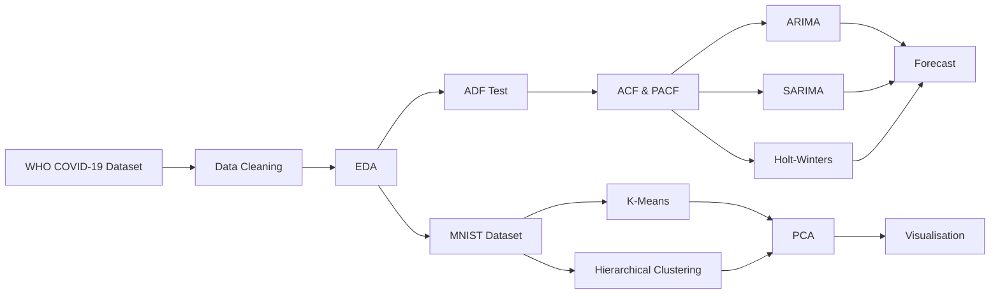

<p align="center">

</p>

<h1 align="center">
📈 Time-Series Analysis of COVID-19 Data and Clustering Analysis
</h1>

<h3 align="center">
Summer Internship Project • IDEAS Technology Innovation Hub (TIH) • Indian Statistical Institute (ISI), Kolkata
</h3>

<p align="center">


</p>

---

# 🌟 Project Highlights

✔ Complete Statistical Time-Series Analysis

✔ Machine Learning based Clustering

✔ Real WHO COVID-19 Global Dataset

✔ Forecasting using ARIMA, SARIMA & Holt-Winters

✔ PCA Visualization

✔ K-Means & Hierarchical Clustering

✔ Comprehensive Statistical Interpretation

✔ Internship Project at **IDEAS Technology Innovation Hub (TIH), ISI Kolkata**

---

# 📚 Table of Contents

- Project Overview
- Objectives
- Dataset
- Exploratory Data Analysis
- Statistical Methods
- Forecasting Models
- Machine Learning Techniques
- Project Workflow
- Key Results
- Repository Structure
- Installation
- Mentor
- Internship Certificate
- Future Work
- Author

---

# 📖 Project Overview

The COVID-19 pandemic generated an unprecedented volume of epidemiological data, creating opportunities for applying modern statistical and machine learning techniques to understand disease dynamics.

This project investigates temporal behaviour in the **WHO COVID-19 Global Daily Dataset** through statistical modelling, forecasting and machine learning.

The study combines **classical time-series analysis** with **unsupervised learning techniques** to analyse two different real-world datasets.

The project consists of two major components:

## 📈 Time-Series Analysis

Using the WHO COVID-19 Global Daily Dataset,

the following analyses were performed:

- Data Cleaning
- Exploratory Data Analysis
- Moving Average Analysis
- Growth Rate Analysis
- Seasonal Decomposition
- Stationarity Testing
- Forecasting

---

## 🤖 Machine Learning Analysis

Using the MNIST handwritten digit dataset,

the following algorithms were implemented:

- K-Means Clustering
- Hierarchical Clustering
- Principal Component Analysis (PCA)

---

# 🎯 Objectives

The primary objectives of this project are:

✅ Analyse temporal patterns in COVID-19 cases.

✅ Identify seasonal behaviour.

✅ Develop forecasting models.

✅ Compare forecasting performance.

✅ Apply unsupervised learning algorithms.

✅ Demonstrate practical applications of Statistics and Machine Learning.

---

# 🌍 Dataset

## 1️⃣ WHO COVID-19 Global Daily Dataset

**Source**

World Health Organization (WHO)

### Features

- Daily Confirmed Cases
- Daily Deaths
- Country
- WHO Region
- Date

Used for:

✔ Exploratory Data Analysis

✔ Forecasting

✔ Time-Series Analysis

---

## 2️⃣ MNIST Handwritten Digit Dataset

The famous benchmark dataset containing handwritten digits (0–9).

Used for

✔ K-Means Clustering

✔ Hierarchical Clustering

✔ PCA Visualization

---

# 📊 Exploratory Data Analysis

The following analyses were performed:

✔ Missing Value Analysis

✔ Data Cleaning

✔ Daily Case Distribution

✔ Monthly Trends

✔ Quarterly Trends

✔ Global Pandemic Waves

✔ Growth Rate Analysis

✔ Moving Average Analysis

✔ Seasonal Decomposition

Several visualisations were generated to understand the behaviour of the pandemic before statistical modelling.

---

# 📈 Statistical Methods

The project incorporates several statistical techniques:

### ✔ Augmented Dickey-Fuller Test

Used to determine stationarity.

### ✔ ACF

To identify Moving Average (MA) order.

### ✔ PACF

To determine Autoregressive (AR) order.

### ✔ Jarque-Bera Test

To assess residual normality.

### ✔ Ljung-Box Test

To examine residual autocorrelation.

---

# 🚀 Forecasting Models

## 📌 ARIMA Model

Implemented using

ARIMA(3,0,1)

Performed

- Forecasting
- Residual Analysis
- Model Diagnostics

---

## 📌 SARIMA Model

Implemented using

SARIMA(3,0,1)(1,0,1)₇

Included

- Weekly Seasonality
- Forecasting
- Residual Diagnostics
- Model Comparison

---

## 📌 Holt-Winters Exponential Smoothing

Implemented using

- Additive Trend
- Additive Seasonality

The model produced the lowest

✔ AIC

✔ BIC

among all forecasting models considered.

---

# 🤖 Machine Learning Techniques

## K-Means Clustering

Applied to

MNIST Handwritten Digit Dataset

Evaluation:

- Macro F1 Score

---

## Hierarchical Clustering

Performed using

Ward Linkage Method

Output:

✔ Dendrogram

✔ Cluster Relationships

---

## Principal Component Analysis

Used for

- Dimensionality Reduction

- Cluster Visualization

- Two-dimensional Representation

---

# 🔄 Project Workflow



---

# 📷 Sample Outputs

The repository includes

📊 Time-Series Plots

📈 ACF & PACF

📉 Residual Analysis

📊 Forecast Plots

📈 Seasonal Decomposition

📊 Dendrogram

📉 PCA Visualization

📈 Clustering Results

---
# 🏆 Key Results

The major findings of this study are summarized below.

## 📈 Time-Series Analysis

- ✔ The COVID-19 case series exhibits significant weekly seasonal behaviour.
- ✔ The Augmented Dickey–Fuller (ADF) test confirmed that the series is stationary.
- ✔ ACF and PACF plots successfully identified suitable model orders.
- ✔ SARIMA outperformed ARIMA by effectively capturing weekly seasonality.
- ✔ Holt-Winters Exponential Smoothing achieved the **lowest AIC and BIC**, indicating the best overall model fit among those considered.
- ✔ Residual diagnostics using the Ljung–Box and Jarque–Bera tests provided insights into model adequacy.

---

## 🤖 Machine Learning

- ✔ K-Means successfully grouped similar handwritten digits.
- ✔ Hierarchical Clustering revealed hierarchical relationships among observations.
- ✔ PCA provided a clear two-dimensional visualization of cluster separation.

---

# 📊 Model Comparison

| Model | AIC | BIC | Performance |
|------|------:|------:|-----------|
| ARIMA(3,0,1) | 37507.017 | 37537.940 | Good |
| SARIMA(3,0,1)(1,0,1)₇ | 36137.435 | 36173.457 | Better |
| Holt-Winters | **31640.421** | **31697.114** | ⭐ Best |

---

# 🛠 Technologies Used

| Category | Tools |
|----------|-------------------------------|
| Programming Language | Python |
| Notebook Environment | Jupyter Notebook |
| Data Manipulation | Pandas, NumPy |
| Data Visualization | Matplotlib, Seaborn |
| Statistical Analysis | Statsmodels, SciPy |
| Machine Learning | Scikit-Learn |
| Documentation | Overleaf (LaTeX) |

---

# ⚙ Installation

Clone the repository

```bash
git clone https://github.com/Debapriyo1110/Time-Series-Analysis-of-Covid-19-Data.git
```

Move into the project directory

```bash
cd Time-Series-Analysis-of-Covid-19-Data
```

Install the required libraries

```bash
pip install pandas numpy matplotlib seaborn scipy scikit-learn statsmodels
```

Launch Jupyter Notebook

```bash
jupyter notebook IDEASTIH_Project.ipynb
```

---

# 📂 Repository Structure

```text
Time-Series-Analysis-of-Covid-19-Data
│
├── 📄 Certificate.pdf
├── 📓 IDEASTIH_Project.ipynb
├── 📘 IDEAS_TIH_Internship_Project_Report.pdf
├── 📊 WHO-COVID-19-global-daily-data.csv
├── 📜 LICENSE
└── 📖 README.md
```

---

# 📈 Skills Demonstrated

✔ Data Cleaning

✔ Exploratory Data Analysis

✔ Time-Series Forecasting

✔ Statistical Modelling

✔ Hypothesis Testing

✔ Residual Diagnostics

✔ Machine Learning

✔ Clustering Algorithms

✔ Principal Component Analysis

✔ Data Visualization

✔ Scientific Report Writing

---

# 👨‍🏫 Mentor

This project was completed under the guidance of

## **Dr. Chandan Biswas**

**Project Lead**

**IDEAS Technology Innovation Hub (TIH)**

**Indian Statistical Institute (ISI), Kolkata**

---

# 📜 Internship Certificate

The internship completion certificate is included in this repository.

📄 **Certificate.pdf**

---

# 🙏 Acknowledgements

I sincerely express my gratitude to

**Dr. Chandan Biswas**

(Project Lead, IDEAS Technology Innovation Hub, ISI Kolkata)

for his continuous guidance, encouragement, and valuable suggestions throughout this internship.

I also thank the **IDEAS Technology Innovation Hub (TIH), Indian Statistical Institute (ISI), Kolkata**, for providing an excellent learning environment and the opportunity to work on real-world applications of Statistics, Time-Series Analysis, and Machine Learning.

---

# 🚀 Future Scope

Possible extensions of this work include:

- 🔹 LSTM-based Deep Learning Forecasting
- 🔹 Facebook Prophet Time-Series Forecasting
- 🔹 Transformer-based Forecasting Models
- 🔹 XGBoost for Time-Series Prediction
- 🔹 Real-time Forecasting Dashboard using Streamlit
- 🔹 Geospatial COVID-19 Analysis
- 🔹 Interactive Web Dashboard

---

# 📚 References

- World Health Organization (WHO) COVID-19 Global Daily Dataset
- Statsmodels Documentation
- Scikit-Learn Documentation
- Hyndman, R.J. & Athanasopoulos, G. *Forecasting: Principles and Practice*
- Box, G.E.P., Jenkins, G.M., Reinsel, G.C. & Ljung, G.M. *Time Series Analysis: Forecasting and Control*

---

# 👨‍💻 Author

## Debapriyo Bhar

🎓 **B.Sc. Major in Statistics**

🏫 Ramakrishna Mission Residential College (Autonomous), Narendrapur

🔬 Summer Intern

IDEAS Technology Innovation Hub (TIH)

Indian Statistical Institute (ISI), Kolkata

📧 **Email**

debapriyobhar@gmail.com

💼 **LinkedIn**

https://www.linkedin.com/in/debapriyo-bhar-5074a6303

🐙 **GitHub**

https://github.com/Debapriyo1110

---

# ⭐ Support

If you found this repository useful,

⭐ **please consider giving it a Star!**

It motivates me to continue developing open-source statistical and data science projects.

---

<p align="center">


</p>

<p align="center">

<b>Made with ❤️ using Python, Statistics, Time-Series Analysis and Machine Learning</b>

</p>
