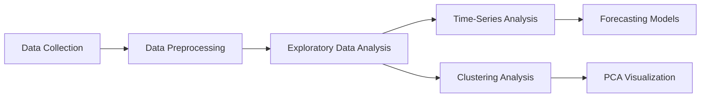

# 📈 Time-Series Analysis of COVID-19 Data and Clustering Analysis

<p align="center">

</p>

<p align="center">


</p>

---

# 📖 Project Overview

This project explores the application of **Statistics**, **Time-Series Forecasting**, and **Machine Learning** techniques on real-world datasets.

The project consists of two major components:

📈 **Time-Series Analysis of the WHO COVID-19 Global Daily Dataset**

🤖 **Clustering Analysis of the MNIST Handwritten Digit Dataset**

The primary objective is to understand temporal patterns, perform forecasting, and discover hidden structures in high-dimensional data.

---

# 🌍 Dataset Used

## 1️⃣ WHO COVID-19 Global Daily Dataset

- Daily confirmed COVID-19 cases.
- Global and regional case trends.
- Used for forecasting and time-series analysis.

## 2️⃣ MNIST Handwritten Digit Dataset

- Handwritten digits (0–9).
- Used for clustering and dimensionality reduction.

---

# 🔍 Exploratory Data Analysis

✔ Data preprocessing and cleaning

✔ Missing value treatment

✔ Global and regional trend analysis

✔ Daily and monthly case distributions

✔ Visualization of pandemic waves

---

# 📈 Time-Series Analysis

The following statistical techniques were applied:

- Moving Average Analysis
- Growth Rate Analysis
- Seasonal Decomposition
- Augmented Dickey–Fuller (ADF) Test
- ACF and PACF Analysis
- Residual Diagnostics

---

# 🚀 Forecasting Models

## ARIMA Model

- Model identification using ACF and PACF.
- Forecasting future observations.
- Residual analysis.

## SARIMA Model

- Seasonal forecasting model.
- Weekly seasonal effects incorporated.
- Model comparison using AIC and BIC.

## Holt-Winters Exponential Smoothing

- Trend and seasonality modelling.
- Best-performing forecasting model based on AIC and BIC.

---

# 🤖 Machine Learning Analysis

## K-Means Clustering

- Unsupervised learning technique.
- Applied on the MNIST dataset.
- Cluster evaluation using Macro F1 Score.

## Hierarchical Clustering

- Dendrogram construction.
- Analysis of cluster relationships.

## Principal Component Analysis (PCA)

- Dimensionality reduction.
- Two-dimensional visualization of clusters.

---

# 📊 Project Workflow



---

# 🏆 Key Findings

✅ The COVID-19 series exhibits significant seasonal behaviour.

✅ SARIMA performed better than ARIMA by capturing seasonality.

✅ Holt-Winters achieved the lowest AIC and BIC values.

✅ K-Means and Hierarchical Clustering successfully identified meaningful structures in the MNIST dataset.

---

# 🛠️ Technologies Used

| Category | Tools |
|----------|--------|
| Programming | Python |
| Libraries | Pandas, NumPy, Matplotlib, Seaborn |
| Statistics | Statsmodels, SciPy |
| Machine Learning | Scikit-Learn |
| Development | Jupyter Notebook, Google Colab |

---

# 📂 Repository Structure

```text
├── data/
├── notebooks/
├── figures/
├── report/
├── README.md
```

---

# 📄 Project Report

📥 Project Report: `report/Project_Report.pdf`

---

# 📬 Author

## Debapriyo Bhar

🎓 B.Sc. Major in Statistics

🏫 Ramakrishna Mission Residential College (Autonomous)

🔬 Summer Intern, IDEAS Technology Innovation Hub (TIH), ISI Kolkata

📧 Email: debapriyobhar@gmail.com

💼 LinkedIn:
https://www.linkedin.com/in/debapriyo-bhar-5074a6303

---

<p align="center">

### ⭐ If you found this project useful, please consider giving it a star!

</p>

<p align="center">

</p>
````
